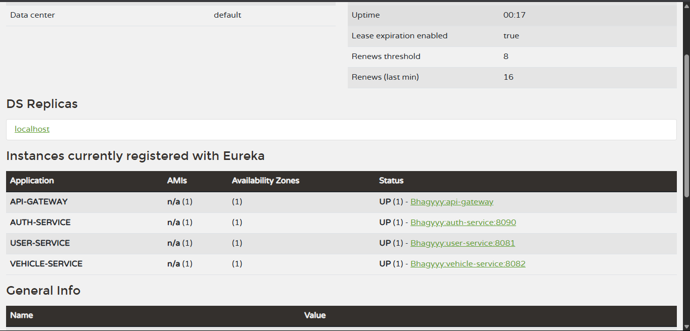

<h1 align="center">🚗Smart Parking Management System 🛠️</h1>

<p align="center">
  <em>Centralized configuration hub for all microservices of the Smart Parking Management System</em><br>
  <strong>Powered by Spring Cloud Config Server ⚙️</strong>
</p>

---

## 📦 What is this?

This repository acts as the **remote brain** 🧠 for all the microservices in the Smart Parking System (SPMS).  
It holds **externalized configuration files** in YAML format, which are automatically fetched by each microservice at startup or during runtime using Spring Cloud Config Server.

> ✨ **Zero restarts. Zero hardcoded values. Maximum flexibility.**

---


## 🛠️ How to Run

### 1. Clone the repository

```bash
git clone https://github.com/dbhagya200/Smart-Parking-Management-System.git
```

---

### 2. Run the following services in this exact order:

1️⃣ **eureka-server**
2️⃣ **config-server**
3️⃣ **api-gateway**
4️⃣ **user-service**
5️⃣ **vehicle-service**
6️⃣ **parking-service**

---

### 3. Access Tools

* 🔍 **Eureka Dashboard:** [http://localhost:8761](http://localhost:8761)
* 🌐 **Gateway Endpoint:** [http://localhost:8080](http://localhost:8080)
* 🛡️ **JWT Authorization:** All secure endpoints require a `Bearer <token>` header.

---


## 📬 Contact

Created by **Dilini Bhagya Warnakulasooriya**
📧 Email: [dilinibhagya53@gmail.com](mailto:dilinibhagya53@gmail.com)
🔗 GitHub: [@dbhagya200](https://github.com/dbhagya200)

---

## 📷 Screenshots
 


---

## 📮 Postman Collection
[Postman Collection](./Smart-Parking-System.postman_collection.json)


> ⭐ *Feel free to star the repo if you found it helpful!*


